```{r setup, include=FALSE}
knitr::opts_chunk$set(echo = FALSE)
```

## IDEAS


--- 


--- 

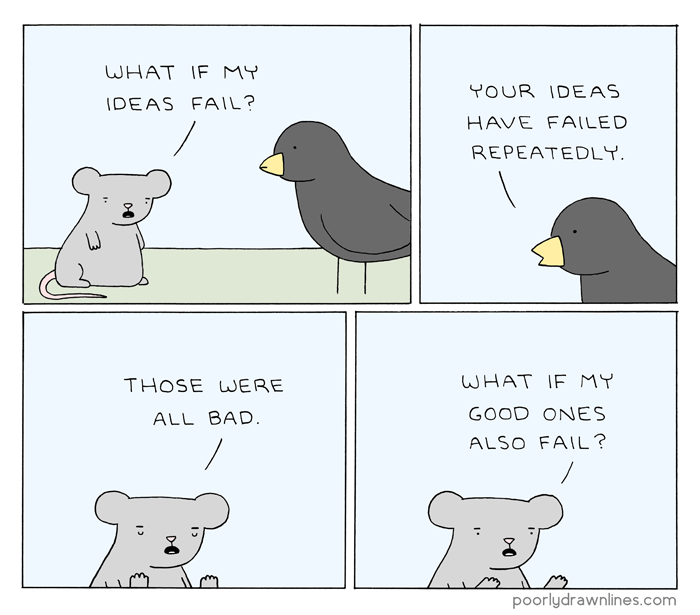

--- 


--- 


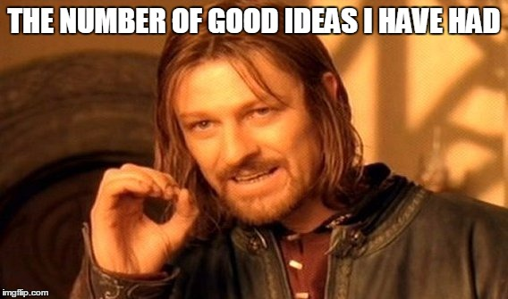

--- 

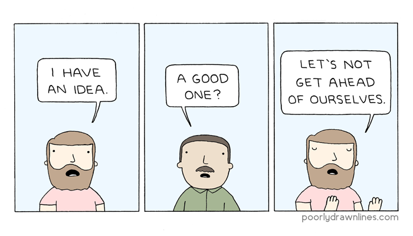

## Data Sciens

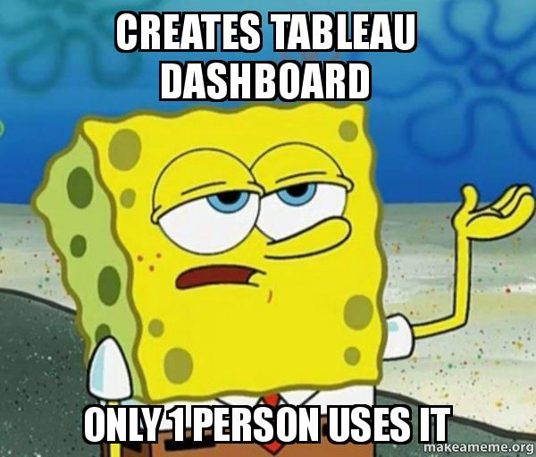)

--- 


--- 

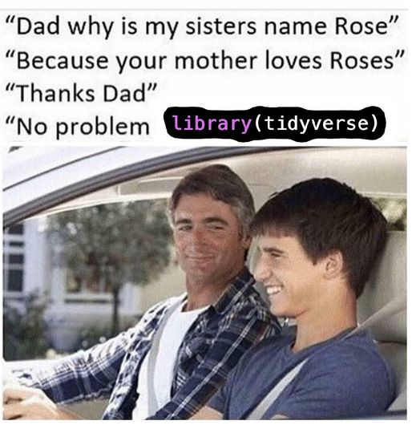

--- 

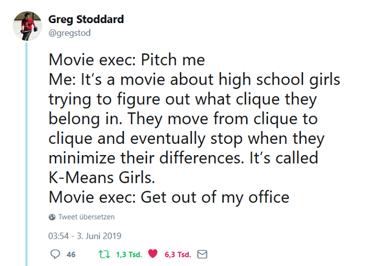

--- 


--- 

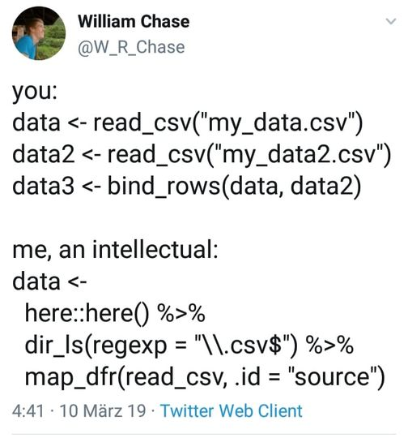

--- 


--- 

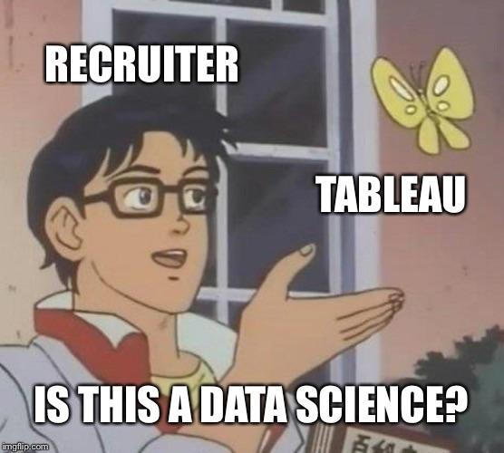

--- 

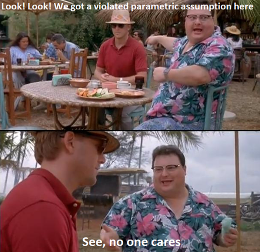

--- 

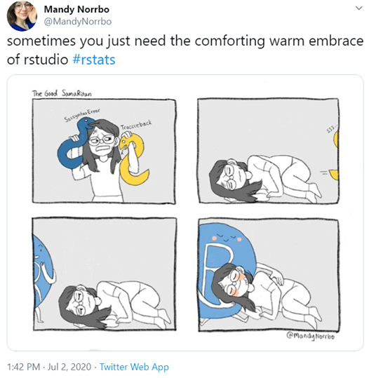

--- 

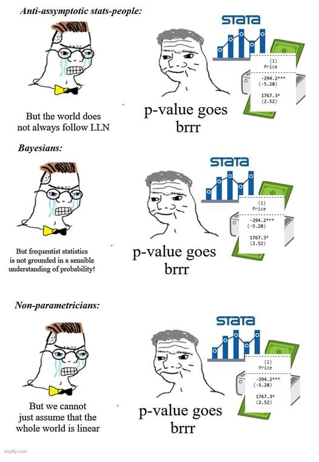

--- 

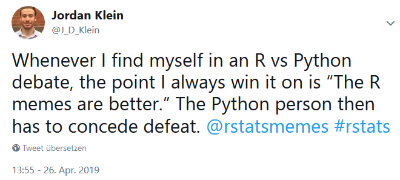

--- 

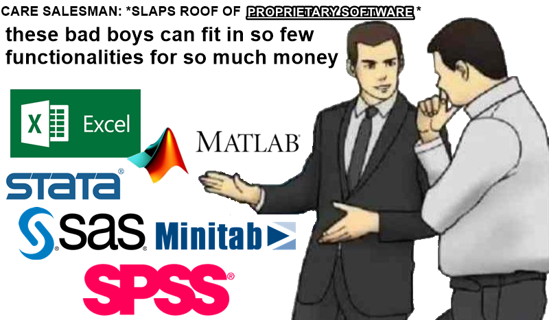

--- 

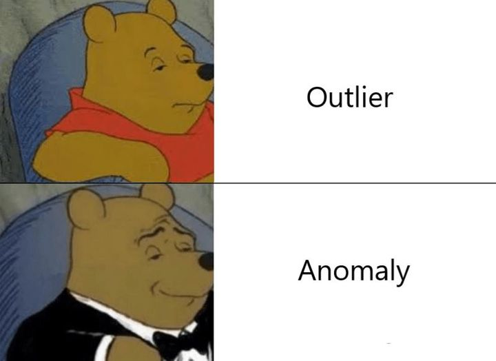

--- 

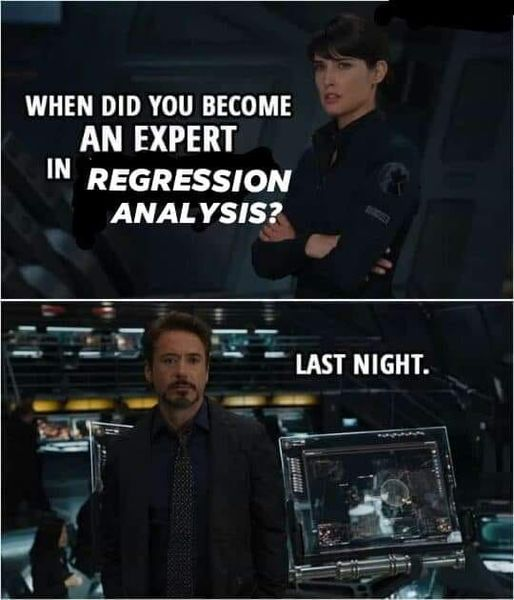

--- 

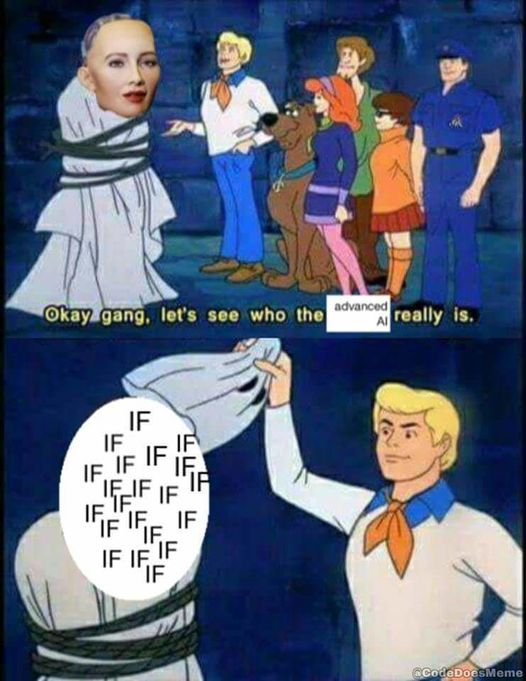

--- 

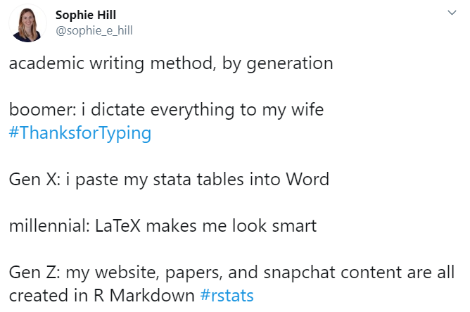

--- 


--- 

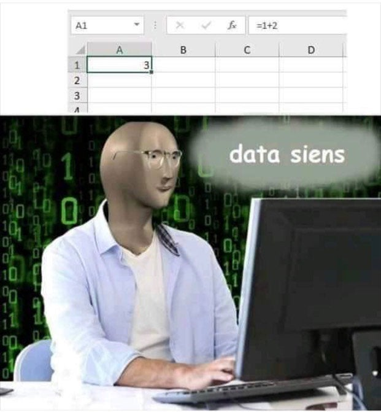

--- 

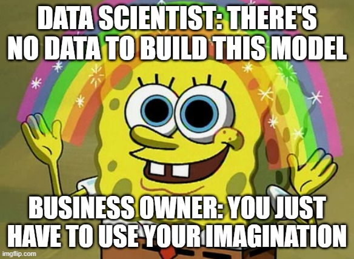

## My Pet Project

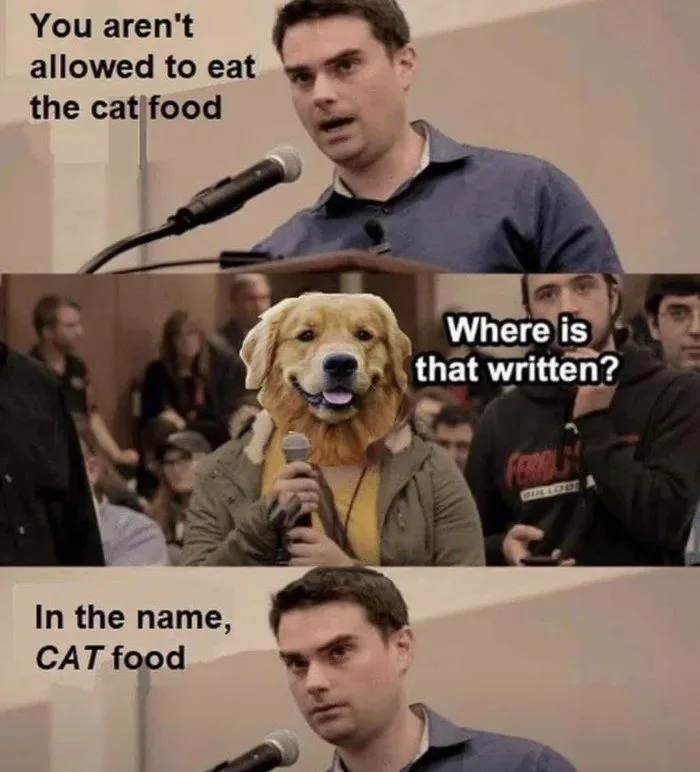
