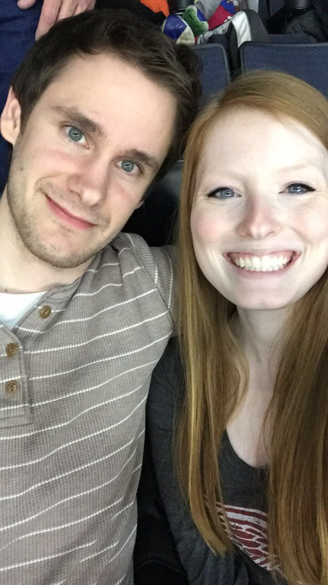
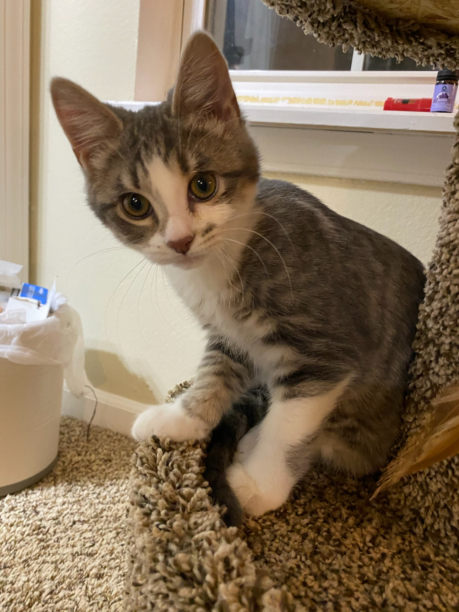

```{r setup, include=FALSE}
knitr::opts_chunk$set(echo = FALSE)

# Learn more about creating websites with Distill at:
# https://rstudio.github.io/distill/website.html

# Learn more about publishing to GitHub Pages at:
# https://rstudio.github.io/distill/publish_website.html#github-pages

```

# The Majors of Me

<div class="mermaid">
graph LR;
  A-->B;
</div>
<script async src="https://unpkg.com/mermaid@8.2.3/dist/mermaid.min.js"></script>

## Fundamental Philosophies

I consider myself a data scientist. People seem to argue the definition of data scientist with the same contention that they swear by apple or android. I believe Josh Willis has one of the better definitions with:

>Data Scientist (n.): Person who is better at statistics than any software engineer and better at software engineering than any statistician.

One academic institution I came across described the role as:

>an analytical expert who utilizes their skills in both technology and social science to find trends and manage data. They use industry knowledge, contextual understanding, skepticism of existing assumptions – to uncover solutions to business challenges.

With so many opinions out there, you'd have to be mad to add your own.... So, my definition of a data scientist would be:

> A problem solver with knowledge of math, software, coding, data and abstraction.

I think its also important to contextualize the work of a data scientist. The following quote comes from Dave Farley, and although its context is for software development, it seems equally applicable to data science.

>Solving Problems is More Important Than Design
>Design is More Important Than Coding
>Coding is More Important than the Language & Frameworks

## I Was Put Under New Management

Probably not the way my wife would like me to phrase our marriage, but she is terribly bored by anything I do involving code, math, or conversation not pertaining to 90-day British Bake-off or whatever MTV reality TV show she's watching. Admittedly, we have rather different hobbies, but the last year of marriage has been amazing. She makes me a better person, and that makes me a better coder and mathematician. She has also made me realize how much cleaner an apartment can be when you put your clothes in a hamper rather than the floor... In any case, we have been blessed by an amazing first year of marriage, and I look forward to the future!



<!-- ## Loosing My Religion -->

<!-- Okay, this is completely a mislabeled section, but how else would I get your attention while referencing [R.E.M.](https://www.youtube.com/watch?v=xwtdhWltSIg). -->


## We Got a Cat!

As of the first week of 2021, I have seriously contemplated transitioning this website to something more useful and relatable to the general public - a repository of cat pictures. You may be thinking, but the internet is already 80% cat pictures and 20% human debauchery, do we really need more cats. 

I could craft a convincing argument, but as Fred Barnard said, a picture's worth a thousand words.



What? No rebuttal? Cat got your tongue?
