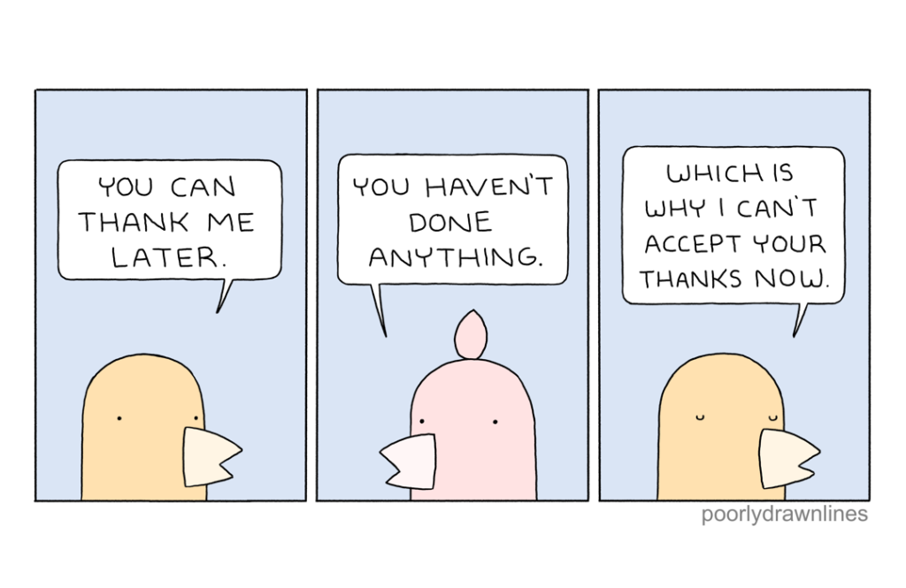
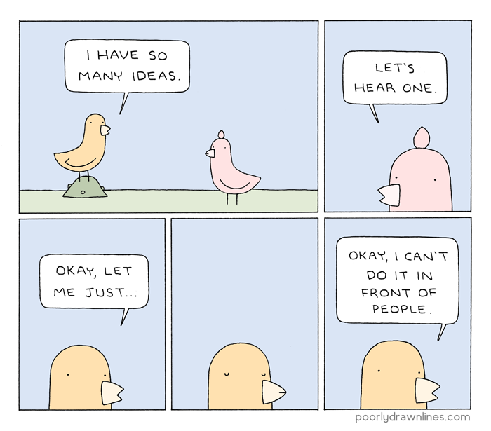
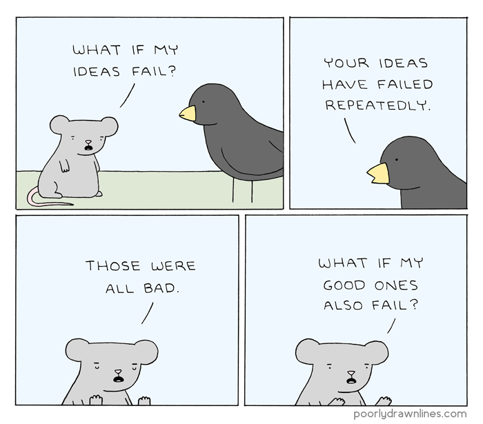
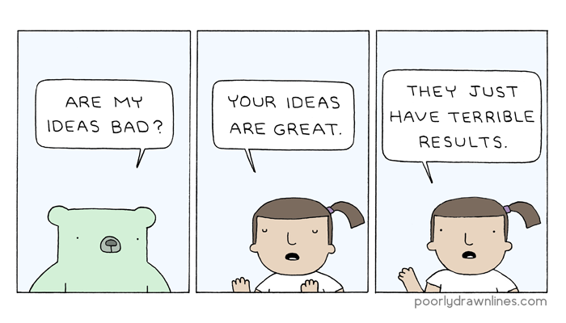

```{r setup, include=FALSE}
knitr::opts_chunk$set(echo = FALSE)
```

## IDEAS











## Data Sciens


<a href="https://imgflip.com/i/4qiibg"></a><div><a href="https://imgflip.com/memegenerator">from Imgflip Meme Generator</a></div>

## My Pet Project

